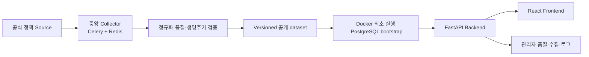

# 청년정책알리미

[](https://github.com/alpha8332/cheongnyeon-alimi/actions/workflows/ci.yml)
[](https://github.com/alpha8332/cheongnyeon-alimi/releases/latest)
[](LICENSE)

지역·연령·관심 분야에 맞는 청년정책을 검색하고 추천받을 수 있는 오픈소스 웹
서비스입니다. 공식 정책 데이터를 정규화해 검색·추천·신청 조건·마감일을 한곳에
보여주고, 수집 이력과 데이터 품질을 관리자 화면에서 추적합니다.

> 대회 심사자와 일반 사용자는 API key, Python, Node.js, PostgreSQL을 설치할
> 필요가 없습니다. Windows와 Docker Desktop만 있으면 공개 정책 데이터가 포함된
> 전체 서비스를 실행할 수 있습니다.

## 바로 실행하기

### 1. 준비 사항

- Windows 10 또는 11
- [Docker Desktop](https://www.docker.com/products/docker-desktop/)과 Docker
  Compose v2
- image·cache·Volume 저장 공간 2 GiB 이상
- 기본 포트 `3000`, `8000`을 사용 중이지 않은 환경

Docker Desktop을 설치한 뒤 화면 왼쪽 아래의 Engine 상태가 실행 중인지
확인합니다. 그 외 개발 도구는 필요하지 않습니다.

### 2. 소스 받기

Git을 사용할 수 있으면 PowerShell에서 다음 명령을 실행합니다.

```powershell
git clone https://github.com/alpha8332/cheongnyeon-alimi.git
cd cheongnyeon-alimi
```

Git이 없으면 GitHub의 **Code → Download ZIP**을 선택하고 ZIP을 해제한 뒤,
해제한 폴더에서 PowerShell을 엽니다.

### 3. 서비스 시작

저장소 루트에서 다음 한 줄을 실행합니다.

```powershell
.\run_docker.bat
```

첫 실행 때 관리자 화면에 사용할 숫자 4자리 PIN을 한 번 입력합니다. PIN 평문은
저장되지 않습니다. 실행기는 다음 작업을 자동으로 처리합니다.

1. Docker·Compose·디스크·포트 확인
2. 공개 정책 dataset 다운로드와 SHA-256 검증
3. Backend·Frontend image build
4. PostgreSQL Migration과 dataset 적재
5. Redis·Backend·수집 worker·scheduler·Frontend 시작
6. health check 통과 후 브라우저 열기

첫 build는 Docker image 다운로드 때문에 시간이 걸릴 수 있습니다. 다음 메시지가
차례대로 표시되면 실행에 성공한 것입니다.

```text
W6_P3_DATASET_VERIFIED: ...
W6_P3_BOOTSTRAP_READY: url=http://127.0.0.1:3000 ...
```

- 사용자 화면: <http://127.0.0.1:3000>
- 관리자 로그인: <http://127.0.0.1:3000/admin/login>
- Backend health: <http://127.0.0.1:8000/health>

관리자 로그인에는 첫 실행 때 입력한 4자리 PIN을 사용합니다.

### 4. 종료와 재실행

컨테이너를 종료하되 정책 DB와 설정을 보존하려면 다음 명령을 사용합니다.

```powershell
docker compose --env-file .env.compose down
```

다시 시작할 때는 `run_docker.bat`을 재실행합니다. 기존 PostgreSQL Volume을
재사용하고 최신 공개 dataset을 검증한 뒤 멱등 반영합니다.

## 주요 기능

| 영역 | 제공 기능 |
| --- | --- |
| 정책 탐색 | 키워드·시·도·시·군·구·연령·분야·신청 상태 검색, 관련도·가나다·마감·수집일 정렬 |
| 정책 상세 | 핵심 신청 조건, 제외 조건, 필요 서류, D-Day, 공식 원문 연결 |
| 맞춤 추천 | 저장한 지역·연령·복수 관심 분야에 따른 결정적 추천, 프로필 우선순위와 추천 이유 |
| 개인 도구 | 브라우저 기반 조건 저장, 폴더형 북마크, 마감 알림·달력, `.ics` 다운로드 |
| 관리자 | 4자리 PIN 세션, 정책 데이터 조회, CollectionRun 실행·이력·상세·stale 표시 |
| 품질·감사 | 수집 품질 집계, 구조화 로그 조회·보관 로그 정리와 감사 기록 |
| 데이터 운영 | 중앙 Celery·Redis 수집 queue, 정책 생명주기, 공개 dataset 검증·승격·rollback |

북마크와 맞춤 조건은 현재 브라우저의 `localStorage`에 저장됩니다. 검색·추천을
실행할 때 필요한 지역·연령·관심 분야만 사용자의 로컬 Backend로 전달하며 외부
정책 Source나 중앙 운영 서버에 저장하지 않습니다. 추천 결과는 신청 자격의 최종
판정이 아니므로 반드시 공식 원문을 함께 확인해야 합니다.

### v1.0.2 QA 개선

- 홈 예시 검색어는 실제 결과가 있는 query로 연결하고, 넓거나 유사한 표현에는
  사용자가 선택할 수 있는 관련 검색어를 제공합니다.
- 지역을 선택하면 해당 시·군·구, 상위 시·도와 전국 대상 정책을 함께 찾습니다.
  지역 근거가 없는 정책은 전국으로 추정하지 않고 `지역 일치 미확인`으로
  구분합니다.
- 프로필 관심 분야는 여러 개 저장할 수 있으며, 자연어 검색 조건을 덮지 않고
  결과의 관련도 우선순위를 보정합니다.
- 복지·주거처럼 여러 분야에 해당하는 정책은 목록·검색·추천·상세에서 모든 분야를
  표시합니다.
- 작성자 DB의 로컬 수집 정책과 공개 dataset을 분리해, 같은 dataset version을
  설치한 심사자와 일반 사용자가 같은 공개 정책 identity 집합을 조회합니다.

구현 범위와 실제 API·Docker·모바일 검증 결과는
[v1.0.2 공개 데이터·검색·추천 QA 개선 기록](docs/troubleshooting/integration/v1_0_2_qa_improvements.md)에서
확인할 수 있습니다.

## 서비스 구조



일반 사용자 PC가 원본 Source API를 반복 호출하지 않습니다. API key와 호출량은
중앙 수집 환경에서만 관리하고, 완전 수집과 품질 검증을 통과한 정규화 dataset만
버전과 hash를 고정해 공개합니다.

Docker Compose 실행 단위는 PostgreSQL, Redis, Migration, dataset bootstrap,
FastAPI Backend, Celery worker·scheduler, React Frontend입니다. 자세한 구조는
[아키텍처 개요](docs/architecture/overview.md)와
[컨테이너 구조](docs/architecture/container_structure.md)를 참고하세요.

## 정책 데이터와 최신성

- 최초 실행에는 온통청년·복지로 API key가 필요하지 않습니다.
- 현재 공개 bootstrap dataset은 `dataset-latest` pointer가 가리키는 검증된
  versioned artifact이며, 정책 수·Source별 건수·SHA-256은 manifest로 확인합니다.
- `run_docker.bat` 재실행 시 최신 dataset pointer와 hash를 다시 검증합니다.
- 신규·변경 정책은 중앙 완전 수집이 성공한 경우에만 새 dataset으로 승격됩니다.
- 종료일이 지난 정책은 KST 기준 기본 검색·추천에서 즉시 제외됩니다.
- 실패·부분 수집에서는 기존 정책을 임의로 비활성화하지 않습니다.
- 실제 Raw, PostgreSQL dump, API key와 개인정보는 GitHub Release에 포함하지
  않습니다.

`2026-08-25`에 검증한 latest pointer는
`public-bootstrap-20260824-897152e7a18c15`이며 총 2,052건입니다. Source별로
복지로 461건, 온통청년 1,587건, 인천 공공데이터 4건이고, 후보 2,114건 중
내용 안전성 경계를 통과하지 못한 62건은 제외됐습니다. 이 수치는 날짜가 고정된
검증 snapshot이며 이후 latest pointer가 승격되면 manifest의 값을 우선합니다.

관리자 화면의 `CollectionRun` 수는 설치·재실행·수동 수집에 따른 로컬 감사
기록이므로 환경마다 다를 수 있습니다. 사용자에게 공개되는 정책 수와 identity는
활성 dataset version과 manifest를 기준으로 비교합니다.

데이터의 재배포 Source·허용 필드·출처 표시는
[공개 정책 dataset 계약](docs/data/public_policy_dataset.md), 생명주기 규칙은
[정책 생명주기 계약](docs/data/policy_lifecycle.md)에서 확인할 수 있습니다.

## 자주 발생하는 문제

| 증상 | 확인 방법 |
| --- | --- |
| `docker.exe`를 찾지 못함 | Docker Desktop을 설치하고 새 PowerShell을 연 뒤 `docker version` 확인 |
| Docker engine이 실행 중이 아님 | Docker Desktop을 실행하고 Engine 시작 완료 후 재시도 |
| `3000` 또는 `8000` 포트 충돌 | 사용 중인 프로그램을 종료하거나 [포트 변경 방법](docs/operations/docker_first_run.md#재실행과-offline-cache) 사용 |
| dataset endpoint 접속 실패 | 이전 검증 cache가 있으면 `run_docker.bat -Offline`, 없으면 네트워크 확인 |
| `.env.compose` 없이 기존 DB Volume 발견 | 기존 환경의 `.env.compose`를 복구하고 소유 관계를 확인한 뒤 실행 |
| 브라우저가 자동으로 열리지 않음 | <http://127.0.0.1:3000>을 직접 열거나 `docker compose --env-file .env.compose ps` 확인 |

실행기의 cache·offline·실패 안전 경계와 상세 복구 절차는
[Windows Docker 최초 실행](docs/operations/docker_first_run.md)을 따릅니다.

> 현재 one-command 실행기는 Windows 10/11에서 검증되었습니다. macOS와 Linux는
> `run_docker.bat` 실행 대상이 아니며 아직 동일한 clean-room Gate를 통과하지
> 않았습니다.

## 개발과 검증

개발자는 [문서 안내](docs/index.md)에서 데이터 계약, API, 아키텍처, 운영과 개발
기록을 찾을 수 있습니다.

- Backend Windows 환경: [backend_local_setup.md](docs/development/backend_local_setup.md)
- Collector 실행과 API key 경계: [collector.md](docs/operations/collector.md)
- Production 배포·dataset 승격: [production_delivery.md](docs/operations/production_delivery.md)
- v1.0.2 QA 개선 기록: [v1_0_2_qa_improvements.md](docs/troubleshooting/integration/v1_0_2_qa_improvements.md)
- 변경 이력: [CHANGELOG.md](CHANGELOG.md)
- 기여 방법: [CONTRIBUTING.md](CONTRIBUTING.md)

CI는 PostgreSQL 기반 Backend/Data 테스트, 문서 계약, Frontend unit·lint·build,
Docker image와 Production Compose 계약을 검증합니다. 현재 Production release와
공급망 증거는 [GitHub Releases](https://github.com/alpha8332/cheongnyeon-alimi/releases)와
[artifact attestations](https://github.com/alpha8332/cheongnyeon-alimi/attestations)에서
확인할 수 있습니다.

## 보안과 비밀정보

`.env.compose`는 첫 실행 때 로컬에 생성되고 Git에서 제외됩니다. 원본 API key,
DB password, 관리자 PIN 평문, Runtime Raw·로그·dump를 Issue나 commit에 올리지
마세요. 공개 저장소에 비밀정보가 노출됐다고 판단되면 값을 즉시 폐기·재발급한 뒤
저장소 관리자에게 비공개 채널로 알려주세요.

## 라이선스

프로젝트 코드는 [MIT License](LICENSE)로 배포합니다. 정책 데이터는 코드
라이선스와 별도이며 각 Source의 재배포 조건과
[공개 정책 dataset 계약](docs/data/public_policy_dataset.md)을 따릅니다.
