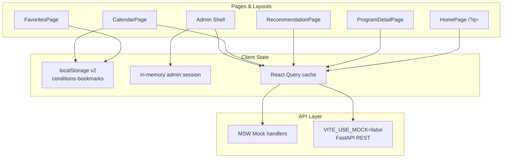

# 프론트엔드 개발 히스토리 (1~5주차)

## 문서 정보

- 상태: completed
- 범위: Frontend 1~5주차 구현·검증 (백엔드·데이터 파이프라인 제외)
- 권위 자료: Forest 개발 기록(`development_notes/frontend/`), Forest 계획
  (`develop_plan/frontend/`), 주차 계획(`weekly_plan/`, `weekly_delivery_plan.md`)
- 코드 기준: `frontend/src/`, `frontend/tests/`, `frontend/e2e/`
- 주차 매핑: 1·2주차는 별도 `weekly_plan/` 파일 없이
  [주차별 실행 계획](develop_plan/weekly_delivery_plan.md)과 Forest 개발 기록이
  권위 자료다. 3~5주차는 [주차별 상세 실행 계획](weekly_plan/README.md)과
  연결한다.

이 문서는 주차별로 **개발한 UI/기능**, **역할·UX 가치**, **구현·기술 설계**를
정리한 종합 참고서다. Slice별 상세 검증 수치·파일 목록은 각 Forest 개발
기록을 따른다.

## 주차–Forest 대응

| 주차 | Release 목표 | Frontend Forest (Slice) | 주차 문서 |
| --- | --- | --- | --- |
| 1주차 | 기반 계약·Mock UI | FE 1 Foundation, FE 2 Policy Discovery 시작 | [weekly_delivery_plan §1주차](develop_plan/weekly_delivery_plan.md) |
| 2주차 | PostgreSQL·Policy API 통합 | FE 2A API 계약, Frontend 02 Router advisory | [weekly_delivery_plan §2주차](develop_plan/weekly_delivery_plan.md) |
| 3주차 | `v0.1.0` 실데이터 검색 | Frontend 04 Policy Search (FE4-xx) | [3주차 상세](weekly_plan/week_03_release_1.md) |
| 4주차 | 사용자·관리자 기능 통합 | FE3·FE5·FE6·FE7·FE8·FE9 | [4주차 상세](weekly_plan/week_04_v0_5_0.md) |
| 5주차 | `v0.5.0` 안정화·UX | W5-F1 회귀 + `style-and-ux-fixes` UX slice | [5주차 상세](weekly_plan/week_05_release_2.md) |

## 전체 라우트·Shell 구조 (5주차 기준)

```text
App (createBrowserRouter)
├── AppShellLayout (사용자)
│   ├── /                    HomePage (추천·NL 검색 통합)
│   ├── /search              PolicySearchRedirect → /?q=
│   ├── /programs            SearchPage (client keyword 목록)
│   ├── /programs/:id        ProgramDetailPage
│   ├── /recommendations     RecommendationPage
│   ├── /favorites           FavoritesPage (폴더 탐색기)
│   ├── /calendar            CalendarPage (2패널 달력)
│   ├── /notifications       NotificationsPage (마감 임박 in-app)
│   ├── /profile             UserProfilePage (저장 조건)
│   └── /admin/*             AdminProtectedRoute → AdminShellLayout
│       ├── /admin           DashboardPage
│       ├── /admin/collectors CollectorPage
│       ├── /admin/runs      CollectionRunsPage
│       ├── /admin/runs/:id  CollectionRunDetailPage
│       ├── /admin/quality   DataQualityPage
│       ├── /admin/policies  AdminPolicyDataPage
│       └── /admin/logs      AdminLogsPage
└── RootErrorFallback (route error boundary)
```

| 계층 | 역할 | 대표 경로 |
| --- | --- | --- |
| Pages | 라우트 단위 화면·데이터 fetch 조합 | `pages/user/*`, `pages/admin/*` |
| Layouts | Shell·sidebar·nav | `AppShellLayout`, `AdminShellLayout` |
| Components | 재사용 UI (policy, search, admin, user) | `components/policy/*`, `components/policySearch/*` |
| Hooks | React Query·session·localStorage 구독 | `useProgramsQuery`, `useFavorites`, `useAdminSession` |
| Utils | DTO 가공·D-Day·ICS·navigation | `policyDeadline.ts`, `policyDetailNavigation.ts` |
| API | Mock-first REST client | `api/policies.ts`, `api/recommendation.ts` |



---

## 1주차 — React·TypeScript·Mock UI 기반

### 개발한 주요 UI/기능

| 영역 | 기능 |
| --- | --- |
| Foundation (FE 1) | React Router, `AppShellLayout`, 공통 Loading/Empty/Error |
| Policy Discovery (FE 2) | Seed Mock 바인딩, 정책 카드·목록·상세·client-side 필터 |
| 사용자 | `HomePage`, `SearchPage`(`/programs`), `ProgramDetailPage` |
| 관리자 | `DataQualityPage` provenance·품질 상태 표시 (와이어프레임) |

### 역할 및 UX 가치

- **정책 탐색 MVP**: canonical Seed 기반으로 정책 제목·기관·카테고리·신청
  상태를 카드/상세에서 확인할 수 있는 최소 사용자 journey를 제공한다.
- **와이어프레임 우선**: 디자인 시스템 없이 Card·Border·텍스트 중심 UI로
  Backend API 계약 검증에 집중한다.
- **예외 상태 가시화**: 로딩·빈 결과·오류를 공통 컴포넌트로 처리해 후속
  Slice에서 패턴을 재사용한다.

### 구현 방식 및 기술 설계

| 항목 | 설계 |
| --- | --- |
| 타입·Mock | `types/policy.ts` (`NormalizedProgram` 1.0.0), `mocks/programs.ts`가 `@seed` alias로 `data/seeds/initial_programs.json` 직접 import |
| API Client | `api/programs.ts` — `VITE_USE_MOCK !== 'false'`일 때 Mock, 동일 함수로 Backend 전환 |
| 라우팅 | 상세 ID `{source_id}--{external_id}` 단일 param (`utils/programId.ts`) |
| 필터 | `SearchPage` client-side 지역·카테고리·연령·키워드 (`policyFilters.ts`) |
| 표시 | `PolicyCard` D-Day·partial 배지, `policyDisplay.ts` fallback |
| 데이터 fetch | `useProgramsQuery` + `@tanstack/react-query` (`lib/queryClient.ts`) |

**관련 문서:** [Policy Discovery 계획](develop_plan/frontend/01_policy_discovery.md),
[Policy Discovery 개발 기록](development_notes/frontend/policy_discovery.md)

---

## 2주차 — 실제 Policy API 연결·Router 안전성

### 개발한 주요 UI/기능

| 영역 | 기능 |
| --- | --- |
| FE 2A | 공개 `PolicyDto`·pagination envelope·숫자 `id` 소비 정합화 |
| Integration D6 | `VITE_USE_MOCK=false` 실제 Policy API 연결·Browser 렌더링 검증 |
| Frontend 02 | React Router RSC advisory 대응 — v8 migration (F0~F3) |

### 역할 및 UX 가치

- **Mock ↔ Real 전환**: 동일 API Client 함수로 Mock/실제 endpoint를 바꿔
  3주차 검색·릴리스 E2E의 기반을 마련한다.
- **보안·회귀**: client-only 앱에서 RSC advisory를 audit 0건으로 해소하고
  라우팅·import 경로를 v8 공식 guide에 맞춘다.
- **계약 검증**: null·빈 배열·partial opt-in을 UI가 그대로 소비함을
  타입·소비 테스트로 고정한다.

### 구현 방식 및 기술 설계

| 항목 | 설계 |
| --- | --- |
| Router | `createBrowserRouter` + `RouterProvider` (`App.tsx`); `react-router@8.3.0`, DOM API는 `react-router/dom` |
| API 전환 | 환경 변수 `VITE_USE_MOCK`, `VITE_API_BASE_URL`; Mock handler와 fetch layer 공유 |
| Error UX | `RootErrorFallback`, route `errorElement` |
| 검증 | `npm run build`·`lint`, Policy DTO 소비 테스트, Browser 수동 UI (2026-07-28) |

**2주차 Frontend 잔여 차이 (3주차로 이월):** Backend keyword·age 검색
미구현, Frontend 검색은 client-only — [weekly_delivery_plan §2주차 남은 차이](develop_plan/weekly_delivery_plan.md)

**관련 문서:** [React Router Advisory 계획](develop_plan/frontend/02_react_router_advisory.md),
[React Router Advisory 개발 기록](development_notes/frontend/react_router_advisory.md),
[Policy Data DB Integration D6](development_notes/integration/policy_data_database_integration.md)

---

## 3주차 — 자연어 정책 검색 (`v0.1.0`)

### 개발한 주요 UI/기능

| 영역 | 기능 |
| --- | --- |
| Search contract (FE4-11~17) | Gate G1 `GET /api/v1/policies/search` TypeScript 타입·Mock-first UI |
| 검색 결과 UX (FE4-18~19) | Partial/Unknown 배지, 우측 sticky Reason sidebar, 미해석 term 안내 |
| IA·내비 (FE4-20~21) | 홈 hero 검색·추천 칩 → 검색 진입, 결과 → 상세 `include_partial` 전달 |
| Actual API (FE4-22, DT7D) | `VITE_USE_MOCK=false` 검색·상세 Browser·golden E2E |

*(5주차 UX slice에서 검색 URL이 `/search?q=` → `/?q=` 홈 통합으로 변경됨.
legacy `/search`는 redirect 유지.)*

### 역할 및 UX 가치

- **자연어 검색**: 사용자 문장을 Backend가 해석한 조건·검색 이유·미확인
  조건과 함께 결과를 보여 준다.
- **비단정 UX**: 「검색 결과는 정책 후보이며 실제 자격 충족을 확정하지
  않는다」 공통 안내, unknown verdict 「미확인」 copy.
- **탐색 연속성**: 카드 선택 시 sidebar verdict 갱신, 상세 이동 시 partial
  query 보존으로 404 방지.

### 구현 방식 및 기술 설계

| 항목 | 설계 |
| --- | --- |
| Search UI | `PolicySearchPage` 2열 (primary + 340px sidebar), `@1100px` 이하 stack |
| Reason | `SearchReasonBlock`, `UninterpretedNotice`, `policySearchReasonHelpers.ts` |
| Navigation | `buildPolicySearchEntryPath`, `buildPolicySearchHitDetailPath`, `policyDetailNavigation.ts` |
| URL state | `q`, `include_partial`, 해석 조건 query — `useSearchParams` |
| Saved conditions merge | `policySearchSavedConditions.ts` — URL에 없는 region·age·category를 localStorage에서 API 요청에 병합 (5주차) |
| API | `api/policySearch.ts`, MSW `policySearchHandlers.ts` |
| 테스트 | `policySearch.reason.test.ts`, `policy-search-audit` E2E, actual golden (조건부) |

**Route 경계 (5주차 기준)**

| Route | API·역할 |
| --- | --- |
| `/?q=` | NL `GET /api/v1/policies/search` (홈 통합) |
| `/search` | `PolicySearchRedirect` → `/?q=` |
| `/programs?search=` | client keyword exact filter (`SearchPage`) |

**관련 문서:** [Policy Search 계획](develop_plan/frontend/04_policy_search.md),
[Policy Search 개발 기록](development_notes/frontend/policy_search.md),
[3주차 상세 — Frontend](weekly_plan/week_03_release_1.md)

---

## 4주차 — 사용자·관리자 기능 통합

4주차는 Frontend Forest FE3·FE5·FE6·FE7·FE8·FE9가 병렬·순차로 완료됐다.
[W4-G4 midpoint](weekly_plan/week_04_v0_5_0.md) 기준 Mock Browser 79건·unit
162건이 기록돼 있다.

### 4-1. 사용자 서비스 (Frontend 05 — FE5)

#### UI/기능

| 기능 | 설명 |
| --- | --- |
| 저장 조건 | region·age·category — 브라우저 localStorage (서버·URL 미저장) |
| 즐겨찾기 | toggle·`/favorites`·카드·상세 동기화 |
| D-Day | KST date-only `D-nn` / `D-Day` (`policyDeadline.ts`) |
| 캘린더 | `/calendar` 북마크·전체 마감 목록 |
| 알림 | `/notifications` 북마크 ∩ D-7 in-app (push 없음) |
| `.ics` | 상세에서 RFC5545 subset VEVENT 다운로드 |
| Cross-route | 추천·캘린더·카드·상세 동일 numeric `policy.id` |

#### UX 가치

로그인 없이 브라우저에 조건·북마크를 저장하고, 마감 임박 정책을 달력·
알림·D-Day로 추적한다. 서버 동기화 없음을 copy로 명시한다.

#### 기술 설계

- **State:** `useSyncExternalStore` + module listener (`useFavorites`,
  `useSavedConditions`); Zustand/Context 미사용
- **Storage:** `userLocalStorage.ts` versioned envelope; corrupt → reset +
  `UserLocalStorageRecoveryBanner` (FE9)
- **Fetch:** favorites page — per-id `getPolicyById(id, include_partial=true)`

### 4-2. 맞춤 추천 (Frontend 06 — FE6)

#### UI/기능

- `/recommendations` — 조건 form, 결과 목록·reason, favorite toggle
- `RegionListCollapse` — 긴 지역 목록 mobile truncate
- Error/empty/loading shell, retry, `RecommendationUnconfirmedBanner` *(5주차 slice에서 페이지·카드 unknown 박스 제거)*

#### UX 가치

구조화 조건 기반 결정적 추천을 NL 검색(`/`)과 route 분리. score 숫자·
단정적 자격 판정 미노출.

#### 기술 설계

- API: `POST /api/v1/recommendations` (`api/recommendation.ts`)
- Form: `savedConditionsForm.ts` — FE5 localStorage와 공유
- Detail link: `buildRecommendationItemDetailPath`, partial 시 `include_partial=true`

### 4-3. 정책 상세 자격요건 (Frontend 07 — FE7)

#### UI/기능

- `EligibilitySummary` — coverage(complete/partial/unknown), requirements,
  exclusions, preferences, documents, unknowns, contacts, evidence
- `ProgramDetailPage`에 summary 렌더; 원문·evidence 링크

#### UX 가치

핵심 신청 조건을 구조화해 보여 주되, 최종 신청 가능 여부는 판정하지
않는다. 빈 목록·unknown은 임의 보완하지 않는다.

#### 기술 설계

- DTO: Integration 08 `EligibilitySummaryDto` (`types/policy.ts`)
- DTL4-5~6: proposal 타입 제거, E2E·fixture id 정렬

### 4-4. 관리자 CollectionRun (Frontend 03 — FE3)

#### UI/기능

| 기능 | 설명 |
| --- | --- |
| PIN 로그인 | 4자리 PIN, 401/422/429 UX, cooldown |
| 실행 이력 | list·filter·pagination, detail·stale badge |
| 수동 실행 | confirm dialog, running 중 disable, list refetch |
| Toast | `ApiErrorToast` — 401 redirect, 5xx retryable, 422 |

#### UX 가치

관리자가 수집 실행 상태를 조회·수동 트리거하고, 세션은 in-memory만
사용(localStorage 금지).

#### 기술 설계

- Session: `adminSessionStorage.ts`, `AdminProtectedRoute`, `useAdminSession`
- Query: `useCollectionRunsQuery`, `collectionRunDisplay.ts`
- E2E: `admin-collection-run.spec.ts`

### 4-5. 관리자 Observability (Frontend 08 — FE8)

#### UI/기능

- `/admin/policies` — CSV형 표, filter·sort·column toggle, row detail drawer
- `/admin/logs` — log file·event filter·detail, rotate·archive delete confirm

#### UX 가치

읽기 전용 정책 데이터·구조화 file log를 Browser에서 조회·유지보수한다.
stack trace·비밀 필드 미노출.

#### 기술 설계

- React Query: `useAdminObservabilityQuery`
- Maintenance: `adminLogMaintenance.ts` typed confirm
- 401 handling: FE9 `useAdminUnauthorizedRedirect` 공통 hook

### 4-6. 통합 수정·회귀 (Frontend 09 — FE9)

| Slice | 내용 |
| --- | --- |
| FE9-01 | W4-F9 triage — admin 401 hook, localStorage recovery banner, lint fix |
| FE9-02 | W4-F10 Mock-first E2E 매트릭스, `week4-regression.spec.ts` |

**공통 오류 UX (4주차 확립)**

- `ApiErrorToast`, `LayoutErrorBoundary`, cached list on 5xx
- Empty state copy, partial badge, loading skeleton 패턴

**관련 문서:** 각 Forest
[FE3](development_notes/frontend/collection_run_admin_ui.md)·
[FE5](development_notes/frontend/user_service_features.md)·
[FE6](development_notes/frontend/recommendation_ui.md)·
[FE7](development_notes/frontend/eligibility_summary_ui.md)·
[FE8](development_notes/frontend/admin_observability_ui.md)·
[FE9](development_notes/frontend/integration_and_regression.md)

---

## 5주차 — 안정화·UX 개선 (`v0.5.0` 준비)

5주차 계획([week_05_release_2.md](weekly_plan/week_05_release_2.md))의
`W5-F1`은 actual API·Browser·오류·접근성·반응형 결함 triage다. 구현 측면에서는
브랜치 `feature/frontend/style-and-ux-fixes`에서 연속 UX slice와 관리자
대시보드 Phase 2가 기록돼 있다.

### 5-1. 계획상 Frontend 안정화 (W5-F1 / W5-FIX)

| 항목 | 내용 |
| --- | --- |
| Actual API mode | `VITE_USE_MOCK=false` 사용자·관리자 Browser 회귀 |
| 오류 UX | Toast·retry·401 redirect·localStorage recovery |
| 접근성·반응형 | sidebar stack, focus-visible, mobile viewport E2E |
| 결함 triage | 영역별 목록 → 승인 수정 → 재검증 (`W5-FIX`) |

독립 사용성·QA(`W5-Q1`)는 Data 06 완료·통합 Gate 이후 — 본 문서는 Frontend
구현 slice만 다룬다.

### 5-2. 정보 구조·내비게이션

| 변경 | UX 가치 | 구현 |
| --- | --- | --- |
| Sidebar 재정렬 | 홈→추천→목록→북마크→달력→알림→관리자→프로필 | `AppShellLayout` |
| `/profile` | 「내 조건 저장」을 홈 clutter에서 분리 | `UserProfilePage` + `SavedConditionsPanel` |
| 홈 NL 검색 통합 | 검색과 홈 featured를 한 화면에서 전환 | `HomePage` + `/?q=` URL state |
| `/search` redirect | legacy URL 호환 | `PolicySearchRedirect` |

### 5-3. 북마크·localStorage v2

| 기능 | UX 가치 | 구현 |
| --- | --- | --- |
| 폴더·모달 | 북마크를 폴더별로 정리 | schema v2, `BookmarkFolderPickerModal` |
| 폴더 탐색기 | 파일 매니저형 grid·breadcrumb·sort·view toggle | `BookmarkFolderGrid`, `BookmarkExplorerToolbar` |
| 폴더 삭제 | 사용자 폴더 삭제(기본 폴더 보호) | `deleteBookmarkFolder`, confirm dialog |
| v1 migrate | 기존 favorites → 「기본 폴더」 | read-time migration |

### 5-4. 캘린더 UX

| 단계 | UI | 기술 |
| --- | --- | --- |
| 월간 grid | ICS/Google 스타일 42-cell grid | `calendarMonthGrid.ts`, `CalendarMonthView` |
| Apple 2패널 | sidebar 필터·미니 달력 + Day/Week/Month/Year | `AppleCalendarLayout`, `CalendarToolbar` |
| 버그 수정 | nested button 제거, ISO→YMD normalize | `normalizePolicyYmd`, 형제 노드 분리 |
| 칩 스타일 | 정책명 ellipsis, category color | `CalendarEventChip`, `calendarCategoryTheme.ts` |

`application_start`·`application_end` 이벤트; `closed`·상시는 slot 미생성
(FE5-03 계약 유지).

### 5-5. 정책 카드·상세·홈

| 기능 | UX 가치 | 구현 |
| --- | --- | --- |
| 상세 구조화 | Summary header·섹션 카드·메타 grid | `PolicyDetailSummaryHeader`, `PolicyDetailSection` |
| 헤더 액션 | 북마크·공식 신청·ICS를 header로 통합 | `PolicyDetailHeaderActions` |
| 날짜·뱃지 | `YYYY.MM.DD` 통일, status·category theme | `formatPolicyDateDot`, `PolicyStatusBadge` |
| 홈 featured | 마감·scheduled 제외 open/always만 | `isHomeFeaturedPolicy` |
| 홈 맞춤 추천 | 저장 조건 → Recommendation API | `useHomeRecommendedPolicies` |
| PolicyCard D-Day | 별 위 `D-nn`/`D-Day` | `getPolicyCardDDayBadgeLabel` |

### 5-6. 검색·추천 UX 단순화 (2026-07-28)

| 변경 | 이유 |
| --- | --- |
| 추천 페이지 상단 eligibility notice·unconfirmed banner 제거 | 중복·시각 noise 감소 |
| 추천 카드 unknown 노란 박스 제거 | 비단정 copy는 list disclaimer 등 잔존 |
| 검색 결과 unknown verdict 배지 제거 | partial 배지만 유지 |
| `/favorites` `UserDataResetPanel` 제거 | 프로필·별도 reset 경로와 역할 분리 *(컴포넌트 파일은 잔존, UI 미연결)* |

### 5-7. 관리자 대시보드 Phase 2

| 페이지 | 기능 | 구현 |
| --- | --- | --- |
| `DashboardPage` | 최신 run 1건 metric card, status badge, drill-down | `adminDashboard.ts`, `AdminMetricCard` |
| `DataQualityPage` | 최근 10회 run failed/invalid/duplicate 비교 table | `useAdminQualityRunSummaries`, parallel detail fetch |

집계 API 범위 밖 건별 failure list는 UI 미구현. Log drill-down은
`/admin/logs`(필터 URL 미지원).

**관련 문서:**
[collection_run_admin_ui Phase 2](development_notes/frontend/collection_run_admin_ui.md),
[user_service_features UX slice](development_notes/frontend/user_service_features.md)

---

## 공통 기술 스택·패턴 (1~5주차 누적)

### 상태 관리

| 데이터 | 방식 | 파일 |
| --- | --- | --- |
| 서버 Policy·Search·Admin | React Query | `hooks/use*Query.ts` |
| 즐겨찾기·조건 | localStorage + `useSyncExternalStore` | `userFavoritesStorage.ts`, `userConditionsStorage.ts` |
| 관리자 세션 | in-memory module state | `adminSessionStorage.ts` |
| UI 일시 state | component `useState` | forms, dialogs, sidebar selection |

### API·Mock

- `VITE_USE_MOCK !== 'false'` → MSW handlers (`mocks/*Handlers.ts`)
- DTO는 Backend OpenAPI·Integration Forest 승인 계약과 TypeScript 동기화
- Real API E2E: `VITE_USE_MOCK=false`일 때만 실행, 기본 skip

### 오류·피드백

| 패턴 | 사용처 |
| --- | --- |
| `LoadingState` / `EmptyState` / `ErrorState` | 목록·검색·추천 |
| `ApiErrorToast` | Admin API 401·422·5xx |
| `RootErrorFallback` / `LayoutErrorBoundary` | route·layout crash |
| `UserLocalStorageRecoveryBanner` | corrupt storage reset 안내 |
| Retry button | recommendation·search error shell |

### 테스트 (Forest 개발 기록 기준, 5주차 UX slice 최종)

| 검증 | 결과 (기록 시점) |
| --- | --- |
| Unit (`npm test`) | 215 passed (2026-07-28 UX slice) |
| Lint / Build | pass |
| E2E (관련 spec) | recommendation 12+1 skip, policy-search, user-service, admin-collection-run pass |
| Docs | `python3 scripts/validate_docs.py` pass |

실행하지 않은 Real API golden·W5-G0~G2 통합 Gate는 본 표에 포함하지
않는다. 최신 수치는 각 Forest 개발 기록을 따른다.

---

## 주차별 기능 성숙도 요약

| 주차 | 사용자 화면 | 관리자 화면 | 상태·Storage | 검색·추천 |
| --- | --- | --- | --- | --- |
| 1 | 홈·목록·상세 wireframe | DataQuality provenance | — | client filter |
| 2 | Real Policy API 연결 | — | — | client filter |
| 3 | NL search·reason sidebar | — | — | Gate G1 API |
| 4 | 북마크·달력·알림·ICS·추천·eligibility | PIN·runs·policies·logs | localStorage v1 | `/recommendations` |
| 5 | 홈 통합·폴더·2패널 달력·상세 polish | Dashboard·Quality 집계 | localStorage v2 | UX simplify·`/?q=` |

---

## 범위 밖·후속 (문서화만)

다음은 1~5주차 Frontend 기록에 명시된 제약이며, 본 문서 작성 시 임의
구현하지 않았다.

- 서버 즐겨찾기·계정 동기화
- Backend 건별 collection failure list UI (API 미제공)
- Admin log page URL filter deep-link
- 북마크 폴더 rename·schema `pinned` 영속
- Production Nginx·6주차 deploy UI (6주차 범위)
- `search_ux_preview.html` — 루트 untracked 참고 파일, 산출물 아님

---

## 관련 문서

### Forest 계획

- [01 Policy Discovery](develop_plan/frontend/01_policy_discovery.md)
- [02 React Router Advisory](develop_plan/frontend/02_react_router_advisory.md)
- [03 CollectionRun Admin UI](develop_plan/frontend/03_collection_run_admin_ui.md)
- [04 Policy Search](develop_plan/frontend/04_policy_search.md)
- [05 User Service Features](develop_plan/frontend/05_user_service_features.md)
- [06 Recommendation UI](develop_plan/frontend/06_recommendation_ui.md)
- [07 Eligibility Summary UI](develop_plan/frontend/07_eligibility_summary_ui.md)
- [08 Admin Observability UI](develop_plan/frontend/08_admin_observability_ui.md)
- [09 Integration Fix and Regression](develop_plan/frontend/09_integration_and_regression.md)

### Forest 개발 기록

- [development_notes/frontend/](development_notes/frontend/) — Slice별 검증 수치·파일 목록

### 주차·Release

- [주차별 실행 계획](develop_plan/weekly_delivery_plan.md)
- [주차별 상세 실행 계획](weekly_plan/README.md)
- [Frontend Real API 수동 테스트 가이드](frontend_real_api_manual_testing_guide.md)
